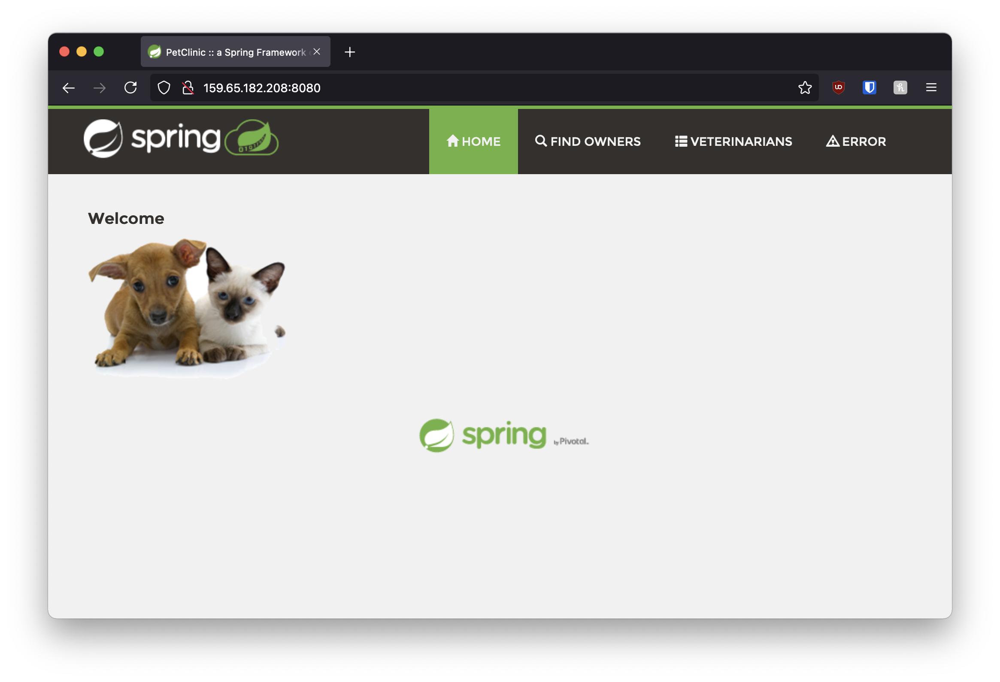

# Docker Containers
## Github
- [flaskex](/flaskex)
- [spring-petclinic](/spring-petclinic)

# Installation and Usage
# Docker Hubs
## [flaskex](https://hub.docker.com/repository/docker/devdot4/flaskex)

# Usage
Pull the image.
```bash
docker pull devdot4/flaskex
```
Run the container.
```bash
docker run -d -p 5000:5000 devdot4/flaskex
```
Go to your VMs IP address.
```bash
http://YOUR-IP-HERE:5000
```
# 
# [spring-petclinic](https://hub.docker.com/repository/docker/devdot4/flaskex)

## Usage
Pull the image.
```bash
docker pull devdot4/spring-petclinic
```
Run the container.
```bash
docker run -d -p 8080:8080 devdot4/spring-petclinic
```
Go to your VMs IP address.
```bash
http://YOUR-IP-HERE:8080
```